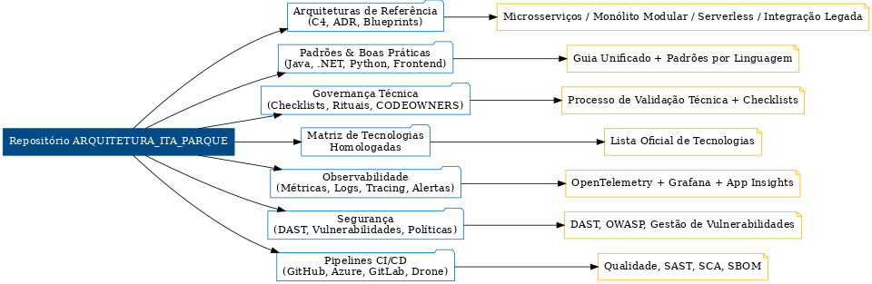

# Arquitetura de Software — Itaipu Parquetec

---

## 📌 Resumo Executivo
Hub institucional para **arquiteturas de referência, padrões técnicos e governança corporativa**.  
Garante **consistência, qualidade, segurança e conformidade** em todos os sistemas, com **padrões auditáveis e pipelines automatizados**.

---

## 📖 Índice
1. [Conteúdo Principal](#-conteúdo-principal)
2. [Como Usar](#-como-usar)
3. [Pipelines Disponíveis](#-pipelines-disponíveis)
4. [Governança e Compliance](#-governança-e-compliance)
5. [Observabilidade](#-observabilidade)
6. [Segurança](#-segurança)
7. [Estrutura do Repositório](#-estrutura-do-repositório)
8. [Atualizações](#-atualizações)
9. [Visão Executiva](#-visão-executiva)

---

📂 <strong>Conteúdo Principal</strong>

- **Arquiteturas de Referência**  
  - C4/ADRs/Blueprints: [`reference-architectures/`](reference-architectures/)
  - Microsserviços (estendido): [`reference-architectures/microservices/blueprint-extended.md`](reference-architectures/microservices/blueprint-extended.md)  
  - Monólito modular: [`reference-architectures/monolith/blueprint-monolito-modular.md`](reference-architectures/monolith/blueprint-monolito-modular.md)  
  - Serverless: [`reference-architectures/serverless/blueprint-serverless.md`](reference-architectures/serverless/blueprint-serverless.md)  
  - Integração legada (SOAP→REST): [`reference-architectures/legacy-integration/blueprint-exemplo-soap-rest.md`](reference-architectures/legacy-integration/blueprint-exemplo-soap-rest.md)

- **Padrões & Boas Práticas**  
  - Guia unificado: [`standards/guia-unificado.md`](standards/guia-unificado.md)  
  - Java (Spring): [`standards/backend-java/`](standards/backend-java/)  
  - .NET 8: [`standards/backend-dotnet/`](standards/backend-dotnet/)  
  - Python (FastAPI): [`standards/backend-python/`](standards/backend-python/)  
  - Front-end (React): [`standards/frontend-react/`](standards/frontend-react/)

- **Matriz de Tecnologias Homologadas**  
  - (Azure, .NET 8, Kafka/Event Hubs, Observabilidade, etc.)  
  → **[Abrir Matriz](ops/matriz-tecnologias/matriz.md)**

---

🛠 <strong>Como Usar</strong>

1. **Tecnologias**: valide na **[Matriz](ops/matriz-tecnologias/matriz.md)**.  
2. **Arquitetura**: escolha um **blueprint** em [`reference-architectures/`](reference-architectures/).  
3. **Padrões**: aplique os guias de [`standards/`](standards/).  
4. **Governança**: siga o **[Processo de Validação Técnica](governance/processo-validacao-tecnica.md)** + **[Checklists](governance/checklists/)**.

---

🚀 <strong>Pipelines Disponíveis</strong>

| Plataforma   | Arquivo |
|---|---|
| GitHub Actions | `standards/cicd/github/.github/workflows/quality.yml` |
| Azure DevOps   | `standards/cicd/azure/azure-pipelines.yml` |
| GitLab CI      | `standards/cicd/gitlab/.gitlab-ci.yml` |
| Drone CI       | `standards/cicd/drone/.drone.yml` |

> Dica: ative **uma** forja como oficial. As demais ficam como referência.

---

🏛 <strong>Governança e Compliance</strong>

- Política de governança: [`governance/politica-governanca.md`](governance/politica-governanca.md)  
- Versionamento & releases: [`governance/versioning-release.md`](governance/versioning-release.md)  
- Rituais do comitê técnico: [`governance/comite-tecnico-rituais.md`](governance/comite-tecnico-rituais.md)  
- ADRs: [`templates/adr.md`](templates/adr.md)  
- CODEOWNERS: [`CODEOWNERS`](CODEOWNERS)

---

📊 <strong>Observabilidade</strong>

- Guia: [`ops/observabilidade-guia.md`](ops/observabilidade-guia.md)  
- OTel — como instrumentar: [`standards/observability/otel-logging-tracing.md`](standards/observability/otel-logging-tracing.md)  
- Monitoring (App Insights/Prom+Grafana): [`ops/monitoring/`](ops/monitoring/)  
- Runbooks & SLOs: [`ops/runbooks/`](ops/runbooks/)

---

🔒 <strong>Segurança</strong>

- DAST (ZAP): [`standards/security/dast-guia.md`](standards/security/dast-guia.md)  
- Gestão de vulnerabilidades: [`standards/security/gestao-vulnerabilidades.md`](standards/security/gestao-vulnerabilidades.md)  
- Políticas de acesso: [`standards/security/politicas-acesso.md`](standards/security/politicas-acesso.md)  
- Supply Chain (SBOM, dependabot): [`standards/cicd/sbom-supply-chain.md`](standards/cicd/sbom-supply-chain.md)

---

📁 <strong>Estrutura do Repositório</strong>

deploy/ # Deploy Azure (App Service, AKS, GitOps)
docs/ # Páginas executivas (MkDocs/links)
governance/ # Governança, processos, checklists, ADRs
ops/ # Matriz, migração (CDC), monitoring, OTel collector
reference-architectures/ # Blueprints e exemplos
standards/ # Padrões por linguagem, CI/CD, observabilidade, segurança
security/ # Semgrep/Trivy baselines
testing/ # Pact, pirâmide de testes
templates/ # ADR/PR/Issue

---

📝 <strong>Atualizações</strong>

- **Baseline** audit-ready concluída (arquiteturas, padrões, governança, CI e segurança).  
- **Última revisão:** 2025-08  
- **Próxima auditoria técnica:** 2025-10

---

## 🎯 Visão Executiva

*Consolida arquitetura, padrões, governança, observabilidade, segurança e pipelines.*

[Matriz de Responsabilidades](/matriz-de-responsabilidades/matriz-de-responsabilidades.md)